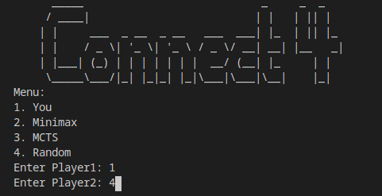
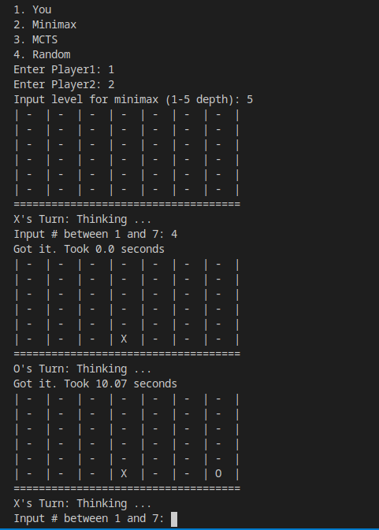
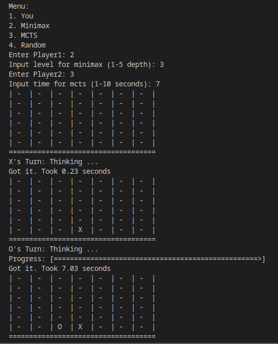
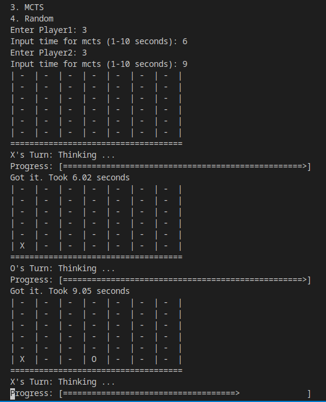

# Connect 4
Players: 2

Information: Perfect Information

Dimensions: 7 columns x 6 rows

## Playing
### Execute:
`foo@bar:~/path/to/folder$ python3 main.py`

#### There are few different options to get started!

#### For Algorithms, You can select 'levels'

#### You can have one algorithm play against the other

#### You can also have an algo play against itself!

## Dependencies
None, written in vanilla Python3

## Code Structure
Board:
    Handles all functions related to the board; from getting current valid moves, to the evaluation functions.

main:
    The main file

MCTS, Minimax:
    The Algorithms

AI_MCTS, AI_Minimax, player
    Helper functions for the algorithms

## Algorithms
### Minimax
Lite. Explained in Tic-Tac-Toe.

### MCTS
Based on the Monte Carlo Sampling Methods, `Monte Carlo Tree Search` remians as one of the most powerful search algorithms. 

&nbsp;&nbsp;&nbsp; While it performs quite decently in smaller games, where it really shines through in in the larger of games. Why? Its scalable. More elaborately, it uses `sampling` methods (as aforesaid) and `deep-backup` methods. Both of them place this algorithm in a special place; while the `sampling` helps in solving large Markov environments (where its not possible to use DP methods), the `deep-backups` part really help in episodic environments. 

&nbsp;&nbsp;&nbsp; The true power of this was fully actualised back in 2016, when `AlphaGo` played against the world grandmaster, `Lee Sedol` in the ancient game of `Go`. This game was thought of as one requiring `human intuition` to master, and no one could imagine a cold machine, running on nothing but some algorithms and a neural net, beating the advanced human brain. But then it happened;  `AlphaGo`, using [Policy and Value Networks](./NOTE.md) along with `MCTS` **annhialated** the best of human brains, by winning `4 to 1`. A brim of success for the researchers; and root of endless questions about the power of `AI` for the rest.

&nbsp;&nbsp;&nbsp; As the "`AI`" algorithms become better day-by-day, some have led to the conclusion: `Lee Sedol was, is, and will remain the ONLY human to defeat an AI of such capability`. The researches have since named the `AlphaGo` version as `AlphaGo Lee` in his respect.
